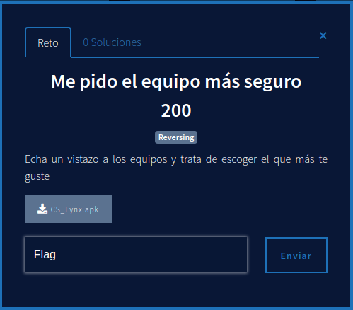
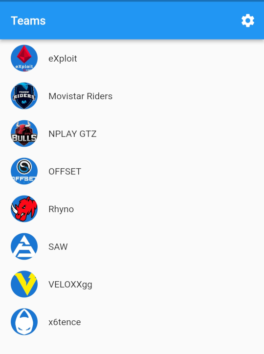
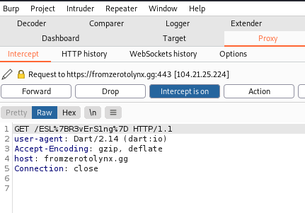

En este reto nos dan una APK Android. El reto es de la categoría reversing, por lo que todo apunta a que vamos a tener que revisar las entrañas de la APK.

Si no sabes la estructura que tiene un archivo apk, ejecutando el comando file sobre el archivo vemos que es un archivo ZIP que contiene todos los archivos de la aplicación.

```bash
kali@kali:~/zerolynx2/MePidoElEquipoMasSeguro$ file CS_Lynx.apk 
CS_Lynx.apk: Zip archive data, at least v?[0] to extract
```

[Aquí](./files/apk_contents.md) está el contenido de la APK. Viendo el listado de archivos vemos que hay muchas referencias a "flutter". En la propia web de [Flutter](https://flutter.dev/) podemos ver que se trata de un framework para crear aplicaciones nativas móviles, web, de escritorio y para dispositivos embebidos a través de un mismo código.

Previamente a este reto no tenía experiencia haciendo ingeniería inversa de aplicaciones Flutter, así que mi primera aproximación fue utilizar los conocimientos que ya tenía sobre APKs.

## Extrayendo las clases del archivo classes.dex
Una de las formas que hay de hacer ingeniería inversa de una APK es tratar de ver el código Java de la aplicación. Para ello es necesario extraer las _classes_ del archivo classes.dex. Esto lo podemos hacer con la herramienta [dex2jar](https://github.com/pxb1988/dex2jar) ejecutando la siguiente línea de comandos:

```bash
kali@kali:~/zerolynx2/MePidoElEquipoMasSeguro/apk$ ../dex-tools-2.2-SNAPSHOT/d2j-dex2jar.sh classes.dex 
Picked up _JAVA_OPTIONS: -Dawt.useSystemAAFontSettings=on -Dswing.aatext=true
dex2jar classes.dex -> ./classes-dex2jar.jar
```

El archivo _jar_ resultante podemos abrirlo con [jd-gui](https://github.com/java-decompiler/jd-gui) para su análisis.

Como podemos ver en la imagen la _MainActivity_ extiende la clase _io.flutter.embedding.android.e_ y no contiene ningún código adicional. Buceando por el paquete _io.flutter_ vemos que la mayoría de los nombres de las clases están ofuscados, por lo que seguir lo que hace el código se hace complicado. Seguir por esta vía para resolver el reto se complica por lo que por el momento decido abandonarla.


## Utilizando apk tool para decompilar archivos de la APK
Otra de las aproximaciones a seguir a la hora de hacer ingeniería inversa de una APK es utilizar herramienta [Apktool](https://github.com/iBotPeaches/Apktool). Ejecutando la siguiente línea de comandos obtenemos el directorio _CS_Lynx_.

```bash
kali@kali:~/zerolynx2/MePidoElEquipoMasSeguro$ java -jar apktool_2.6.0.jar d CS_Lynx.apk 
Picked up _JAVA_OPTIONS: -Dawt.useSystemAAFontSettings=on -Dswing.aatext=true
I: Using Apktool 2.6.0 on CS_Lynx.apk
I: Loading resource table...
I: Decoding AndroidManifest.xml with resources...
I: Loading resource table from file: /home/kali/.local/share/apktool/framework/1.apk
I: Regular manifest package...
I: Decoding file-resources...
W: Cant find 9patch chunk in file: "drawable-mdpi-v4/notification_bg_normal_pressed.9.png". Renaming it to *.png.
W: Cant find 9patch chunk in file: "drawable-xhdpi-v4/notification_bg_low_pressed.9.png". Renaming it to *.png.
W: Cant find 9patch chunk in file: "drawable-mdpi-v4/notification_bg_low_normal.9.png". Renaming it to *.png.
W: Cant find 9patch chunk in file: "drawable-hdpi-v4/notification_bg_normal.9.png". Renaming it to *.png.
W: Cant find 9patch chunk in file: "drawable-mdpi-v4/notification_bg_normal.9.png". Renaming it to *.png.
W: Cant find 9patch chunk in file: "drawable-hdpi-v4/notification_bg_low_normal.9.png". Renaming it to *.png.
W: Cant find 9patch chunk in file: "drawable-mdpi-v4/notification_bg_low_pressed.9.png". Renaming it to *.png.
W: Cant find 9patch chunk in file: "drawable-xhdpi-v4/notification_bg_low_normal.9.png". Renaming it to *.png.
W: Cant find 9patch chunk in file: "drawable-xhdpi-v4/notification_bg_normal.9.png". Renaming it to *.png.
W: Cant find 9patch chunk in file: "drawable-hdpi-v4/notification_bg_normal_pressed.9.png". Renaming it to *.png.
W: Cant find 9patch chunk in file: "drawable-hdpi-v4/notification_bg_low_pressed.9.png". Renaming it to *.png.
W: Cant find 9patch chunk in file: "drawable-xhdpi-v4/notification_bg_normal_pressed.9.png". Renaming it to *.png.
I: Decoding values */* XMLs...
I: Baksmaling classes.dex...
I: Copying assets and libs...
I: Copying unknown files...
I: Copying original files...
```

Analizando el archivo (AndroidManifest.xml)[./files/AndroidManifest.xml] podemos ver que la aplicación pide el siguiente permiso:

```xml
<uses-permission android:name="android.permission.INTERNET"/>
```

Lo cual quiere decir que la aplicación accede a Internet, y poder interceptar su tráfico puede ser interesante para el análisis.

## Utilizando reFlutter para resolver el reto

Buscando información en Internet encuentro varios blogs que explican como hacer ingeniería inversa de aplicaicones hechas con Flutter, pero el contenido aunque interesante parece muy avanzado por lo que sigo buscando hasta que encuentro este [blog](https://tinyhack.com/2021/03/07/reversing-a-flutter-app-by-recompiling-flutter-engine/) en el que se habla de usar las herramientas [darter](https://github.com/mildsunrise/darter) y [Doldrums](https://github.com/rscloura/Doldrums) para extraer los nombres de las clases de la aplicación de _libapp.so_ (no lo he comentado antes pero esta librería nativa es la que contiene el código de aplicación del usuario). Así que pruebo a usar una de las herramientas con la siguiente línea de comandos:

```bash
kali@kali:~/zerolynx2/MePidoElEquipoMasSeguro/CS_Lynx$ python3 ../Doldrums/src/main.py lib/x86_64/libapp.so out.txt
Traceback (most recent call last):
  File "/home/kali/zerolynx2/MePidoElEquipoMasSeguro/CS_Lynx/../Doldrums/src/main.py", line 77, in <module>
    isolate = parseELF(args.file)
  File "/home/kali/zerolynx2/MePidoElEquipoMasSeguro/CS_Lynx/../Doldrums/src/main.py", line 26, in parseELF
    loadLibraries(blobs[0])
  File "/home/kali/zerolynx2/MePidoElEquipoMasSeguro/CS_Lynx/../Doldrums/src/main.py", line 47, in loadLibraries
    raise Exception('Unsupported Dart version: ' + version)
Exception: Unsupported Dart version: 9cf77f4405212c45daf608e1cd646852
```

Pero me encuentro con un error que dice que no la versión de Dart de el _libapp.so_ no está soportada. Esto no me sorprende porque en el propio blog ya explicaban que no todas las versiones de Dart están soportadas.

Buscando en Google por la versión que da el error encuentro esta [web](https://pythonrepo.com/repo/ptswarm-reFlutter-python-security) en la que se habla de la herramienta _reFlutter_, "un framework para ayudar en la ingeniería inversa de aplicaciones Flutter usando una versión parcheada de la biblioteca Flutter". Veo que sus principales características son las siguientes:
 - Versión de `socket.cc` parcheada para intercepción y monitorización de tráfico
 - Versión de `dart.cc` modificada para imprimir clases, funciones y algunos campos
 
La herramienta se puede instalar a través de _pip_. Una vez instalada la podemos ejecutar como se indica a continuación:

```bash
kali@kali:~/zerolynx2/MePidoElEquipoMasSeguro$ reflutter CS_Lynx.apk 
Example: (192.168.1.154) etc.
Please enter your BurpSuite IP: 192.168.1.101

SnapshotHash: 9cf77f4405212c45daf608e1cd646852
The resulting apk file: ./release.RE.apk
Please sign,align the apk file

Configure Burp Suite proxy server to listen on *:8083
Proxy Tab -> Options -> Proxy Listeners -> Edit -> Binding Tab

Then enable invisible proxying in Request Handling Tab
Support Invisible Proxying -> true
```

Nos pedirá la IP donde el proxy de nuestro BurpSuite estará escuchando (será el encargado de interceptar las peticiones HTTP), y generará el archivo _release.RE.apk_ que tendremos que firmar para poder instalarlo en un dispositivo android, usando por ejemplo [uber-apk-signer](https://github.com/patrickfav/uber-apk-signer/releases/tag/v1.2.1). El comando a ejecutar es el siguiente:

```bash
kali@kali:~/zerolynx2/MePidoElEquipoMasSeguro$ java -jar uber-apk-signer-1.2.1.jar --allowResign -a release.RE.apk
Picked up _JAVA_OPTIONS: -Dawt.useSystemAAFontSettings=on -Dswing.aatext=true
source:
        /home/kali/zerolynx2/MePidoElEquipoMasSeguro
zipalign location: BUILT_IN 
        /tmp/uapksigner-11257887162411097159/linux-zipalign-29_0_22300928264034025359.tmp
keystore:
        [0] 161a0018 /tmp/temp_5593041418494412363_debug.keystore (DEBUG_EMBEDDED)

01. release.RE.apk

        SIGN
        file: /home/kali/zerolynx2/MePidoElEquipoMasSeguro/release.RE.apk (17.06 MiB)
        checksum: 638d418ca66c4c72a3c9042772a8cce675b307f91d54fa3c1fb5730c5ac68d49 (sha256)
        - zipalign success
        - sign success

        VERIFY
        file: /home/kali/zerolynx2/MePidoElEquipoMasSeguro/release.RE-aligned-debugSigned.apk (17.06 MiB)
        checksum: 220124b3ddf46e326ba127eba44a6c7dcbbc4632568ca59b3ef6d85271acae59 (sha256)
        - zipalign verified
        - signature verified [v1, v2, v3] 
                19 warnings
                Subject: CN=Android Debug, OU=Android, O=US, L=US, ST=US, C=US
                SHA256: 1e08a903aef9c3a721510b64ec764d01d3d094eb954161b62544ea8f187b5953 / SHA256withRSA
                Expires: Thu Mar 10 15:10:05 EST 2044

[Tue Nov 02 15:31:37 EDT 2021][v1.2.1]
Successfully processed 1 APKs and 0 errors in 2.56 seconds.

```

Ahora solo nos queda configurar BurpSuite como se indica en el enlace, instalar la APK en un dispositivo android (que esté conectado a la misma red que el equipo donde tenemos BurpSuite) y abrir la APK y esperar a recibir alguna conexión.

Al abrir la App veremos lo siguiente.



Una lista de equipos. Si pulsamos sobre cualquiera de ellos veremos que BurpSuite intercepta la siguiente petición:



Por lo que ya tenemos la flag:

```
ESL{R3vErS1ng}
```

Nota: Quizás el creador del reto tenía en mente que para resolverlo se hiciese ingeniería inversa del archivo _libapp.so_ y ver como se construía la flag en memoria, pero a mi personalmente me pareció más fácil esta aproximación.

Nota 2: reFlutter también permite ver que código de la aplicación se carga en la DartVM utilizando _adb logcat_, pero para resolver el reto no fue necesaria esta funcionalidad, por eso no la he usado.